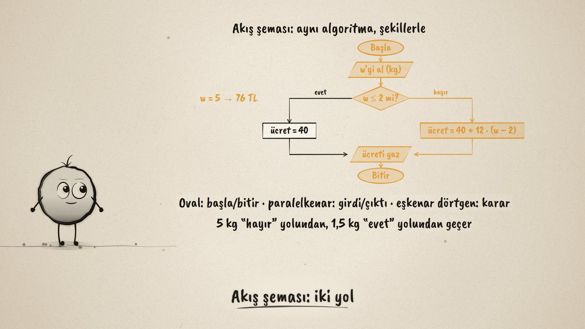
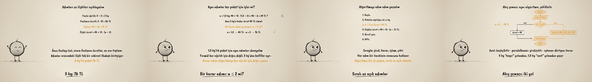

# Kargo Algoritması · Structuring a Process as an Algorithm

**▶ Tarayıcıda izleyin / Watch in the browser:** https://hakanatas.github.io/kargo-algoritmasi/ 
**⬇ MP4 + altyazılar / MP4 + subtitles:** [Releases](https://github.com/hakanatas/kargo-algoritmasi/releases) 
**✎ Kullanılan istem / The prompt behind it:** [PROMPT.md](PROMPT.md) 
**🎞 Bütün filmler / All films:** [Nokta'nın Filmleri](https://hakanatas.github.io/nokta-filmleri/?sinif=7)

> **TR —** 7. sınıf matematik "İşlemlerle Cebirsel Düşünme ve Değişimler" temasındaki MAT.7.2.4 öğrenme çıktısı için hazırlanmış, tamamen JavaScript ile çizilen 92 saniyelik mürekkep animasyonu. Bir kargo şirketi 2 kg'a kadar 40 TL alıyor, sonraki her kilogram için 12 TL ekliyor. 5 kg'lık paketin ücreti adım adım bulunuyor (5 − 2 = 3, 3 · 12 = 36, 40 + 36 = 76 TL) ve adımlar arasındaki ilişki tek bir ifadede birleşiyor: ücret = 40 + 12 · (w − 2). Aynı adımlar 1,5 kg için denenince 34 TL çıkıyor; oysa 2 kg'a kadar ücret 40 TL olmalı: bir karar adımı gerekiyor (w ≤ 2 mi?). Algoritma önce numaralı adımlarla yazılıyor, sonra akış şemasıyla çiziliyor (oval: başla/bitir, paralelkenar: girdi/çıktı, eşkenar dörtgen: karar); 5 kg "hayır", 1,5 kg "evet" yolundan geçiyor. Altyazılar Türkçe, İngilizce ya da ikisi birlikte seçilebilir.

A 92-second ink animation for **7th-grade maths**. Nokta, the ink character from [The Learning Ink](https://github.com/hakanatas/the-learning-ink), is the guide again. The flowchart is drawn by one function (`flow` in `scenes/scene1.js`) that takes the route to light up, so the same chart is traced once for 5 kg and once for 1.5 kg.

## Learning outcome

MEB, Türkiye Yüzyılı Maarif Modeli, Ortaokul Matematik, 7th grade, "İşlemlerle Cebirsel Düşünme ve Değişimler" theme:

**MAT.7.2.4. Temel aritmetik ve cebirsel ifadelerle işlem içeren durumlardaki süreci algoritma ifade yöntemlerini kullanarak yapılandırabilme**
- a) Aritmetik ve cebirsel ifadelerle işlem içeren durumlardaki adımları ve ilişkileri açıklar.
- b) Algoritma ifade yöntemlerini kullanarak incelediği adımlar ve ilişkilerden uyumlu bir bütün oluşturur.

## Scenes

| # | Time | Scene | What happens | Outcome |
|---|---|---|---|---|
| 1 | 0–10 s | Kargo | 40 TL up to 2 kg, then 12 TL a kilogram: how much for 5 kg? | a |
| 2 | 10–28 s | Adımlar | 5 − 2 = 3, 3 · 12 = 36, 40 + 36 = 76; fee = 40 + 12 · (w − 2). | a |
| 3 | 28–46 s | Karar | For 1.5 kg the formula gives 34 TL: a decision step is needed. | a, b |
| 4 | 46–64 s | Adım listesi | Six numbered steps with the decision. | b |
| 5 | 64–80 s | Akış şeması | The same algorithm as a flowchart, traced for 5 kg and 1.5 kg. | b |
| 6 | 80–92 s | Aklında kalsın | Explain the steps, test them, add a decision, write it down. | a, b |

## Running it

- **Preview:** double-click `index.html` (it works offline).
- **MP4:** run `npm install` once, then `npm run export -- --format=horizontal --captions=tr`.
- **Subtitles and narration:** `npm run srt` writes `out/captions_*.srt` and `narration_notes.txt`.
- **Editing:**
  - Caption text, timings and narration notes: `captions.js`
  - Everything on screen is drawn by `LI.world(t)` in `scenes/scene1.js` (the working, the numbered steps in `STEPS`, the flowchart, the words); the other scenes only set the camera.
  - Nokta's poses: `src/draw/film.js`; layout for 16:9 and 9:16: `src/draw/kd.js`

It uses the same engine as The Learning Ink: `renderFrame(t)` as a pure function of time, seeded randomness, and frame-by-frame export.

## Lisans · License

**TR —** Bu film ve kodu [Creative Commons Atıf-GayriTicari 4.0 Uluslararası (CC BY-NC 4.0)](https://creativecommons.org/licenses/by-nc/4.0/deed.tr) lisansıyla paylaşılır. Ticari olmayan her amaçla (derste, okulda, eğitim materyalinde) kopyalayabilir, paylaşabilir ve değiştirebilirsiniz; ancak **kaynak göstermek zorunludur**: eser sahibinin adı ve bu deponun bağlantısı belirtilmeden kullanılamaz. Ticari kullanım (satış, ücretli ürün ya da yayın) için izin alınmalıdır.

**EN —** This film and its code are licensed under [Creative Commons Attribution-NonCommercial 4.0 International (CC BY-NC 4.0)](https://creativecommons.org/licenses/by-nc/4.0/). You may copy, share and adapt them for non-commercial purposes, but **attribution is required**: they may not be used without crediting the author and linking to this repository. Commercial use requires permission.

Atıf örneği / Required credit: *“Kargo Algoritması”, Hakan Ataş, Nokta'nın Filmleri — https://github.com/hakanatas/kargo-algoritmasi — CC BY-NC 4.0*
